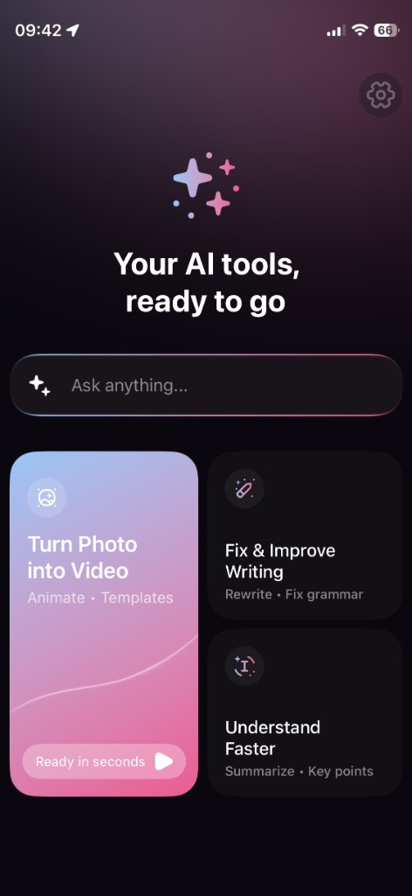
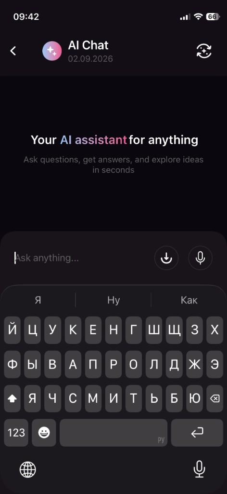
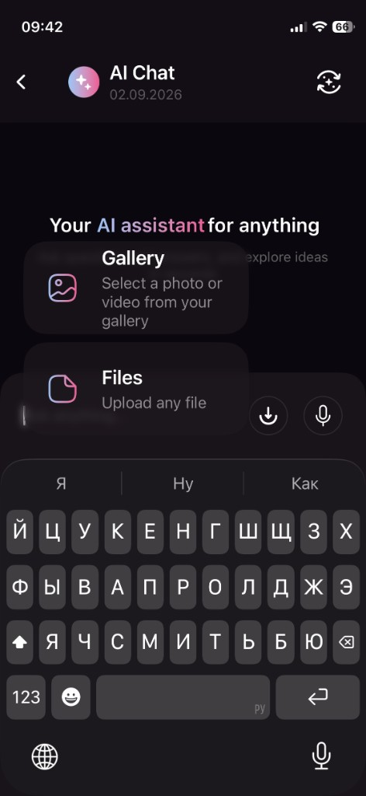
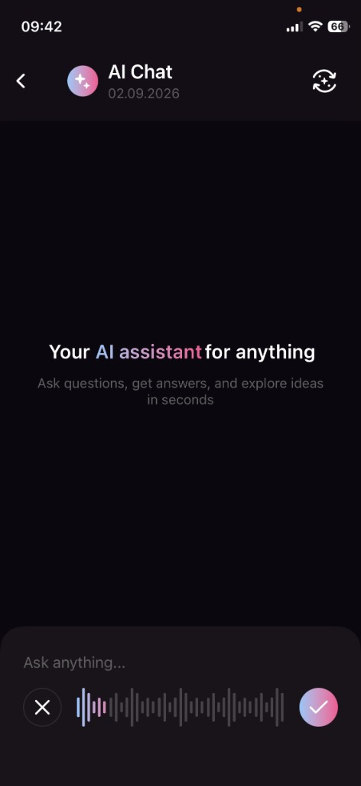
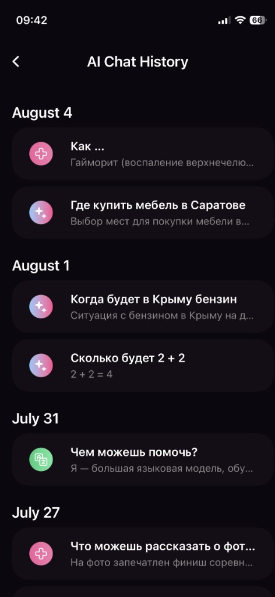
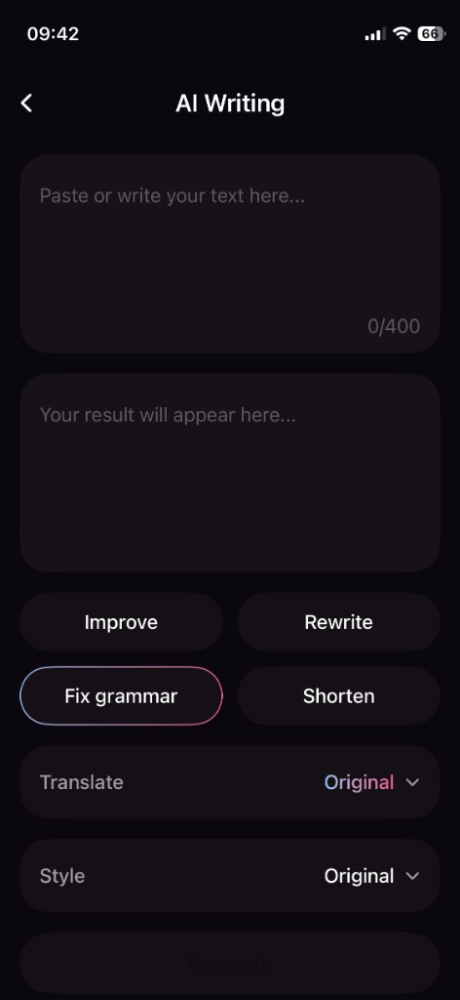
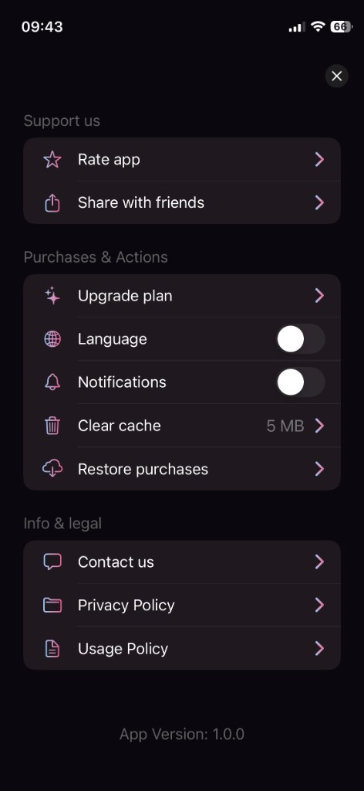

# AI Studio

**iOS-приложение с набором AI-инструментов в едином интерфейсе.**

SwiftUI · iOS 17+ · SwiftData · Observation

---

## Скриншоты

<p align="center">
  
</p>

<p align="center">
  
  &nbsp;
  
  &nbsp;
  
</p>

<p align="center">
  
  &nbsp;
  
  &nbsp;
  
</p>

---

## Возможности

| Модуль | Описание |
|---|---|
| **AI Chat** | Стриминг-ответы, вложения, голосовой ввод, история сессий |
| **AI Video** | Генерация видео по шаблонам, настройка качества и формата (временно без генерации!!!) |
| **AI Writing** | Переписывание и улучшение текста с готовыми сценариями |
| **Understand Faster** | Краткое содержание документов и аудио |

Дополнительно: paywall, локализация (EN / RU), тёмная тема.

---

## Стек

- **UI** — SwiftUI, кастомная Design System
- **Архитектура** — MVVM + `@Observable`
- **Хранение** — SwiftData (история чатов)
- **AI** — Gemini (основной), OpenRouter и Cerebras (failover)
- **Сеть** — `AsyncThrowingStream`, OpenAI-compatible API

---

## Быстрый старт

### Требования

- Xcode 15+
- iOS 17+
- API-ключи: [Gemini](https://aistudio.google.com/apikey), [OpenRouter](https://openrouter.ai/), [Cerebras](https://cloud.cerebras.ai/)

### Запуск

```bash
git clone https://github.com/Deser7/AIStudio-iOS.git
cd AIStudio-iOS
```

1. Открой `AIStudio.xcodeproj` в Xcode
2. Скопируй `AIStudio/Resources/Secrets.example.plist` → `Secrets.plist`
3. Вставь ключи в `Secrets.plist`
4. Собери и запусти на симуляторе или устройстве

> `Secrets.plist` в `.gitignore` — не коммить ключи.

---

## Структура проекта

```
AIStudio/
├── App/              # Точка входа, настройки
├── Features/         # Экраны (Chat, Video, Writing, …)
├── Components/       # Переиспользуемые UI-компоненты
├── DesignSystem/     # Цвета, типографика, фоны
├── Models/           # Доменные модели
├── Services/         # API, чат, speech, persistence
├── Navigation/       # AppRoute
└── Resources/        # Assets, локализация, Secrets
```

---

## AI-провайдеры

Текстовый чат работает через цепочку отказоустойчивости:

```
Gemini → OpenRouter → Cerebras
```

Мультимодальные запросы (изображения) — только через Gemini.

---

## Автор

Андрей Спиридонов
